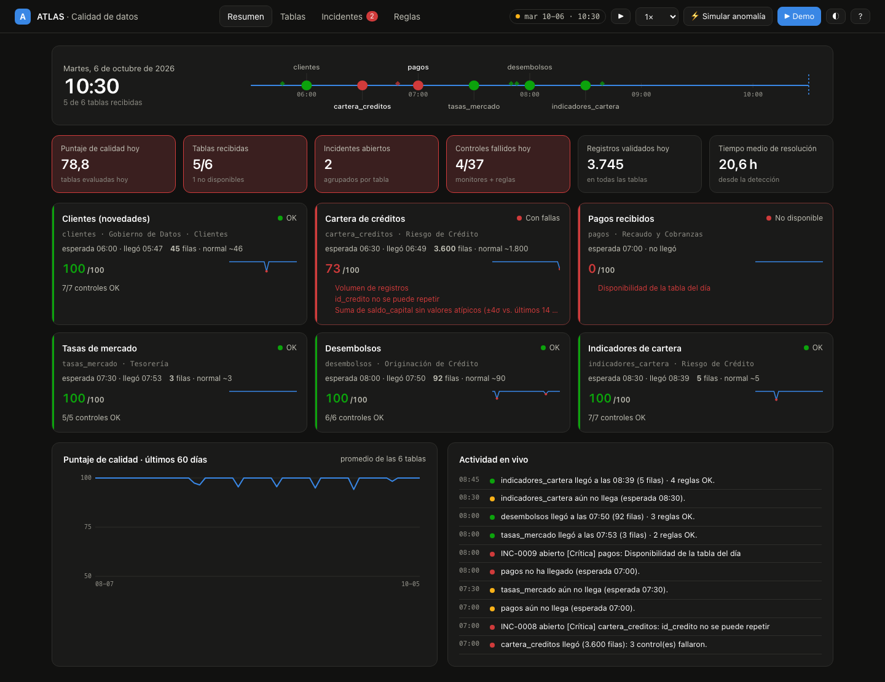
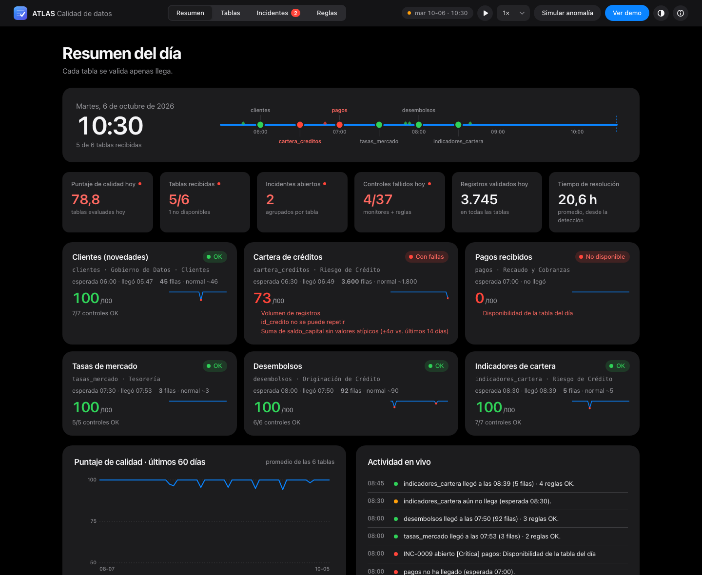
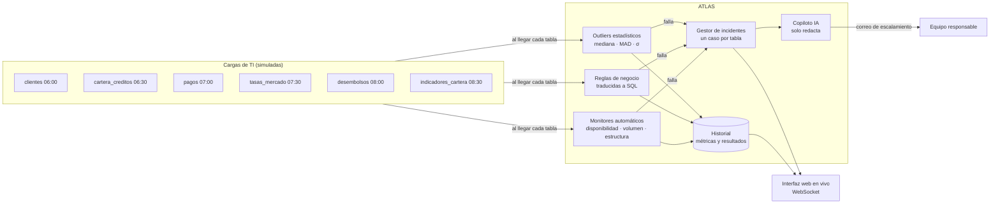
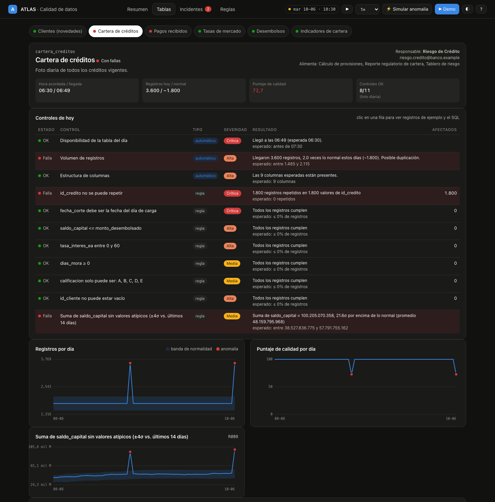
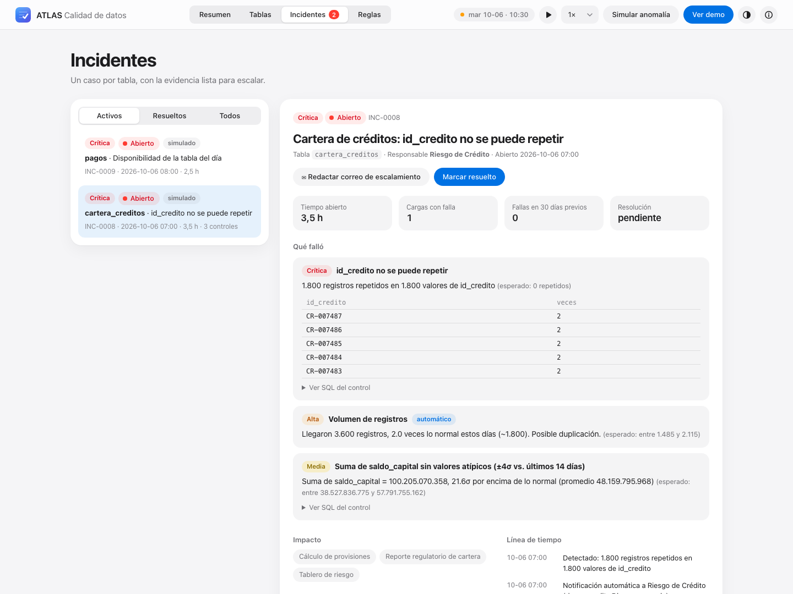
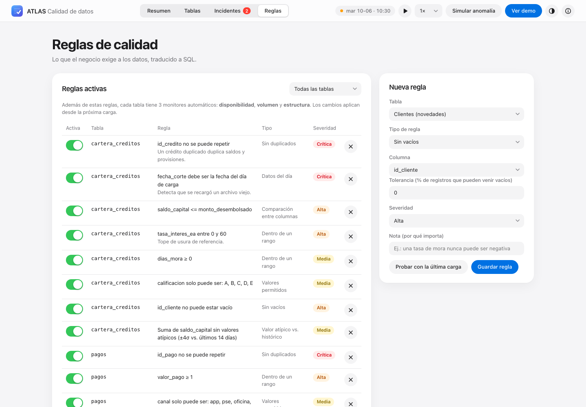

# ATLAS — Data Quality & Reliability Monitor

**Monitor continuo de calidad y disponibilidad para tablas corporativas, con reglas configurables, detección estadística de anomalías, incidentes y escalamiento asistido por IA.**

[](https://github.com/diegosaaval/atlas-data-quality/actions/workflows/ci.yml)




<details><summary>Ver en modo oscuro</summary>



</details>

> 🇬🇧 *ATLAS monitors the tables other teams load every day: SLA-based availability, weekday-aware volume anomalies, schema checks, business rules compiled to SQL, standard-deviation outliers, and one incident per table with evidence and an AI-drafted escalation email. Deterministic checks decide; AI only explains.*

🟢 **Demo en vivo:** _(pendiente de despliegue)_ · ▶️ **Video demo (2:47):** _(pendiente de subir a YouTube)_ · 📄 **[Decisiones de diseño](docs/DISENO.md)**

---

## El problema

Las áreas de negocio dependen de tablas que otro equipo carga cada mañana. Cuando una carga llega **tarde, vacía, duplicada, con el archivo de ayer o con valores imposibles** (una tasa de mora negativa), lo normal es que alguien se entere cuando el reporte ya salió mal.

ATLAS **no construye ni administra el pipeline de origen**. Observa los datos que ya existen y responde, tabla por tabla y cada día:

1. **¿Llegó a tiempo?**
2. **¿Llegó completa?**
3. **¿Cumple las reglas del negocio?**
4. **¿Se comporta como siempre?**
5. **Si no, ¿quién lo arregla y con qué evidencia?**

> **Proyecto personal.** No es un sistema de la entidad donde trabajé ni lo encargó esa organización. Lo diseñé y desarrollé por mi cuenta, a partir de lo que hacía a diario en banca: validar las cargas de TI (duplicados, nulos, desviaciones, reglas como *tasa de mora ≥ 0*) para escalar incidentes a tiempo. Todos los datos son sintéticos.

## Arquitectura



- **Los controles deciden; la IA solo explica.** Si una tabla pasa o falla lo decide una regla determinística y probada. El copiloto resume la evidencia, propone la causa probable y redacta el correo.
- **Un incidente por tabla.** Una carga duplicada dispara duplicados, volumen y outlier, pero genera **un solo caso** con toda la evidencia.
- **Cierre automático.** El incidente se cierra cuando la siguiente carga cumple todos los controles, y queda medido el tiempo de resolución.

## Controles

### Monitores automáticos (toda tabla los tiene)

| Monitor | Qué detecta | Cómo |
|---|---|---|
| **Disponibilidad** | La tabla no llegó o llegó tarde | Hora acordada + 60 min de gracia |
| **Volumen** | Carga vacía, parcial o duplicada | Filas de hoy vs. **el mismo día de la semana** (un domingo no se compara con un lunes) |
| **Estructura** | Columnas faltantes o nuevas | Columnas recibidas vs. esperadas |

### Reglas de negocio (se crean desde la interfaz, sin programar)

| Tipo | Ejemplo |
|---|---|
| Sin vacíos (con tolerancia %) | `numero_documento` no puede estar vacío |
| Sin duplicados (1 o más columnas) | `id_credito` no se puede repetir |
| Rango | `tasa_mora` entre 0 y 100 |
| Valores permitidos | `canal` ∈ {app, pse, oficina, corresponsal} |
| Comparación entre columnas | `saldo_capital <= monto_desembolsado` |
| Datos del día | `fecha_corte` = fecha de carga (detecta el archivo de ayer) |
| Outlier estadístico | Suma de `valor_desembolso` dentro de ±4σ del histórico |
| SQL personalizado (solo lectura) | `indicador = 'TRM' AND (valor < 2500 OR valor > 7000)` |

Cada regla **se traduce a SQL**, que se muestra en la interfaz, y **se puede probar con la última carga antes de guardarla**. Las reglas SQL personalizadas se validan y se ejecutan con `PRAGMA query_only` (no pueden modificar datos).

### Línea base robusta

- Centro = **mediana**. Dispersión = máx(**desviación estándar**, 1,4826·**MAD**, 5% del centro, √n para conteos).
- Los días anómalos **nunca** entran a la línea base: una carga mala no "enseña" que lo malo es normal.
- **Resultado medido:** menos de 1,5% de falsos positivos en 720 cargas simuladas (verificado por un test).



## Incidentes y escalamiento

Cada incidente trae: **severidad, evidencia, SQL, registros de ejemplo, responsable, consumidores afectados, recurrencia en 30 días, línea de tiempo y estado** (abierto → escalado → resuelto). Los críticos se notifican automáticamente.

El copiloto redacta el correo de escalamiento con causa probable, impacto y acción solicitada. Usa **plantillas por defecto** y **Claude** si hay `ANTHROPIC_API_KEY`; ante cualquier error vuelve a la plantilla, de modo que el monitor nunca depende de la IA.



## Escenarios de la demo

Desde **Simular anomalía** (o en la demo guiada de 2 minutos, botón **Ver demo**) se puede provocar cualquiera de estos 13 problemas reales. Todos se detectan y un test lo verifica:

| Escenario | Tabla | Lo detecta |
|---|---|---|
| La tabla no llega | pagos | disponibilidad |
| Llega 2 horas tarde | desembolsos | disponibilidad (se cierra solo al llegar) |
| Carga vacía (ingesta borrada) | pagos | volumen |
| Carga parcial (~35%) | pagos | volumen |
| Cargada dos veces | cartera_creditos | duplicados + volumen + outlier |
| Se recarga el archivo de ayer | cartera_creditos | datos del día |
| Saldo mayor al monto desembolsado | cartera_creditos | comparación entre columnas |
| Tasa de mora negativa | indicadores_cartera | rango + outlier |
| Pico de desembolsos (error de unidades) | desembolsos | outlier |
| Clientes sin documento | clientes | sin vacíos |
| Canal de pago desconocido | pagos | valores permitidos |
| Desaparece una columna | pagos | estructura |
| TRM con valor atípico | tasas_mercado | SQL personalizado |



## Datos de ejemplo

Un banco sintético (determinístico por semilla) carga cada mañana 6 tablas con comportamiento realista: cartera estable de ~1.800 créditos, mora entre 3% y 6%, fines de semana con menos movimiento. Arranca con **70 días de historia**, incluidos incidentes pasados, para que las tendencias tengan sentido desde el primer minuto.

| Tabla | Responsable | Hora | Tipo |
|---|---|---|---|
| clientes | Gobierno de Datos · Clientes | 06:00 | incremental |
| cartera_creditos | Riesgo de Crédito | 06:30 | foto diaria |
| pagos | Recaudo y Cobranzas | 07:00 | incremental |
| tasas_mercado | Tesorería | 07:30 | foto diaria |
| desembolsos | Originación de Crédito | 08:00 | incremental |
| indicadores_cartera | Riesgo de Crédito | 08:30 | agregado diario |

## Stack

Python 3.11+ · FastAPI · SQLite · SQL · WebSocket · HTML/CSS/JavaScript nativo (sin build, gráficos SVG propios, diseño inspirado en las guías de Apple, modo claro y oscuro) · pytest · ruff · Docker · GitHub Actions · Render · Claude API (opcional)

## Cómo correrlo

### Sin comandos (doble clic)

| Windows | Mac | Linux |
|---|---|---|
| **`Iniciar ATLAS.bat`** | **`Iniciar ATLAS.command`** | `./start.sh` |

La primera vez el lanzador:

1. busca Python 3.11 o más reciente y, si no está, lo instala (Windows con `winget`, Mac con Homebrew) o abre la página de descarga;
2. prepara el entorno e instala los componentes (necesita internet, cerca de 1 minuto);
3. crea un **acceso directo «ATLAS» con su ícono en el escritorio**;
4. abre el navegador y muestra en la ventana la dirección para **abrirlo desde el celular** (misma red Wi-Fi).

Las veces siguientes arranca en segundos. Si ATLAS ya está abierto, solo abre el navegador. Opciones: `--test` corre las pruebas, `--reinstall` rehace el entorno y `--sin-acceso` no crea el acceso directo.

> En Mac, la primera vez que abras un archivo descargado de internet: clic derecho → **Abrir** → **Abrir**.

### Con Docker

```bash
docker compose up --build
```

Luego abre <http://localhost:8000>.

### Con comandos

```bash
python -m venv .venv && source .venv/bin/activate
pip install -e ".[dev,ai]"
uvicorn atlas.api:app --reload
```

### Demo pública en internet

[](https://render.com/deploy?repo=https://github.com/diegosaaval/atlas-data-quality)

El botón publica una copia propia y gratuita en [Render](https://render.com) usando [`render.yaml`](render.yaml). En modo demo pública las reglas base quedan protegidas, cada visitante puede crear reglas propias y nadie puede reiniciarla ni dejarla en pausa. En el plan gratuito la demo se duerme tras 15 minutos sin visitas: la primera visita tarda cerca de un minuto en despertarla, y arranca de nuevo con 70 días de historia.

### Configuración

| Variable | Para qué | Por defecto |
|---|---|---|
| `ATLAS_TICK_SECONDS` | Segundos reales por cada 15 minutos simulados | `1.0` |
| `ATLAS_RANDOM_ANOMALIES` | Aparecen anomalías aleatorias de vez en cuando | `1` |
| `ATLAS_PUBLIC_DEMO` | Protege la demo cuando es pública | `0` |
| `ATLAS_RULES_PATH` | Archivo donde se guardan las reglas | `data/reglas.json` |
| `ATLAS_SEED` | Semilla del banco sintético | `7` |
| `ANTHROPIC_API_KEY` | Si se define, Claude redacta los correos; si no, plantillas | sin definir |
| `PORT` | Puerto (lo usan Render, Railway y Fly) | `8000` |

Ver [`.env.example`](.env.example).

## Tests y calidad del código

```bash
pytest --cov=atlas
```

- **69 tests**, **95% de cobertura**, lint con **ruff**.
- Cubren cada tipo de regla y su SQL, los monitores, **los 13 escenarios** (detección y cierre automático), la **tasa de falsos positivos**, la seguridad de las reglas SQL, el copiloto con su fallback, la API completa (REST y WebSocket), las protecciones de la demo pública y el lanzador (incluido el acceso directo de Mac).
- El CI de GitHub Actions corre lint y tests en Python 3.11, 3.12 y 3.13, construye la imagen Docker y hace una prueba de humo del contenedor.

## API

| Método | Ruta | |
|---|---|---|
| `WS` | `/ws` | estado en tiempo real |
| `GET` | `/api/state` | resumen del día |
| `GET` | `/api/tables/{tabla}` | controles, historial, outliers, perfil de columnas |
| `GET` `POST` `PATCH` `DELETE` | `/api/rules` | gestión de reglas |
| `POST` | `/api/rules/preview` | probar una regla con la última carga |
| `POST` | `/api/incidents/{id}/copilot` | redactar correo de escalamiento |
| `POST` | `/api/incidents/{id}/escalate` · `/resolve` | gestión del incidente |
| `POST` | `/api/scenarios/{id}` | simular una anomalía |
| `GET` | `/metrics` | métricas en formato Prometheus |

## Estructura

```
atlas/
  tables.py     tablas monitoreadas (responsable, horario, consumidores) y banco sintético
  store.py      SQLite: datos cargados + historial de métricas y resultados
  rules.py      tipos de regla, traducción a SQL, línea base y outliers
  monitors.py   disponibilidad, volumen y estructura
  engine.py     validación al llegar cada tabla, puntajes e incidentes
  copilot.py    correo de escalamiento (plantilla o Claude)
  api.py        FastAPI: REST + WebSocket + métricas
web/            interfaz en vivo
tests/          69 tests
docs/           capturas, decisiones de diseño y guía de entrevista
run.py          lanzador (lo usan Iniciar ATLAS.bat / .command y start.sh)
```

## Hoja de ruta

- [x] Monitor sobre tablas simuladas, reglas configurables, incidentes y copiloto
- [ ] Despliegue público con Docker
- [ ] Conector a una base real (PostgreSQL / SQL Server, solo lectura)
- [ ] Conector cloud (S3 + Athena con IAM de solo lectura)
- [ ] Monitorear las tablas gold de **FINFLOW**, mi pipeline financiero en AWS

ATLAS seguirá siendo un **monitor**, no un ETL.

## Autor

**Diego S** · [GitHub](https://github.com/diegosaaval)

Análisis del problema, diseño de la solución y desarrollo.

## Licencia

[MIT](LICENSE)
