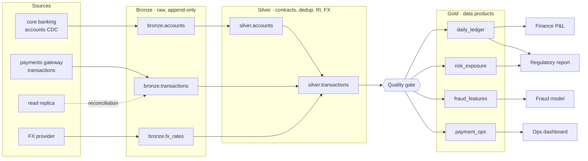

# ATLAS ONE

**A production-style reference implementation of a data reliability platform for financial data.**
Detect → contain → explain → recover, live in your browser.

[](https://github.com/<your-user>/atlas-one/actions/workflows/ci.yml)


> 🇪🇸 **Resumen:** ATLAS ONE simula una plataforma de datos bancaria en tiempo real (core banking, pagos, réplica, FX → bronze → silver → gold → reportes). Ejecuta controles de calidad determinísticos, bloquea datos malos con un *quality gate* basado en linaje, abre incidentes con causa raíz, blast radius y runbook, y tiene un **Failure Lab** para romper la plataforma en vivo y ver cómo se recupera. Guía de entrevista y demo en [docs/PITCH.md](docs/PITCH.md).

---

## Why

In banks and fintechs, bad data is expensive and usually discovered by the wrong person:
a duplicated batch inflates the ledger, a silent schema change breaks the regulatory report,
a late partition starves the fraud model. Most portfolio projects show a pipeline that works.
**ATLAS shows what happens when it doesn't** — and how a well-designed platform contains the damage.

## What you can do in the UI

| View | What it shows |
|---|---|
| **Overview** | Live reliability score (criticality-weighted), freshness SLO, MTTD/MTTR, rows processed vs quarantined vs held, estimated compute cost, per-dataset checks, last DAG run and an event feed. |
| **Lineage** | 17 assets from source systems to consumers. Hover to trace upstream/downstream; edges held back by the quality gate animate in red. |
| **Failure Lab** | Inject 10 real failure modes and watch a step-by-step timeline: injected → detected → gate → incident → blast radius → runbook → remediation → recovered. |
| **Incidents** | Root cause, severity, owner, failing checks, grouped downstream symptoms, blast radius, runbook, timeline, **AI copilot** briefing and one-click remediation. |
| **Contracts** | Versioned YAML data contracts with types, rules, PII classification and quarantine counts. |
| **Risk signals** | Fraud features from `gold.fraud_features`, with **PII masked by role** (viewer / engineer / admin). |

Also: a **2-minute guided demo** (`d`), **chaos mode** (random faults that auto-heal), keyboard shortcuts (`1`–`6`, `space`, `t`), light/dark theme.

## Quickstart

**One click** (only needs Python 3.11+, the launcher offers to install it if missing):

| OS | Do this |
|---|---|
| Windows | double-click **`start.bat`** |
| macOS | double-click **`start.command`** (first time: right-click → Open) |
| Linux | `./start.sh` |

It creates `.venv`, installs dependencies (first run only), picks a free port, starts the server and opens the browser.
`start.bat --test` runs the test suite; `--reinstall` rebuilds the environment.

With Docker:

```bash
docker compose up --build              # http://localhost:8000
```

With Prometheus + Grafana:

```bash
docker compose --profile observability up --build   # :8000 app · :9090 Prometheus · :3000 Grafana
```

Without Docker (Python 3.11+):

```bash
make install && make dev               # http://localhost:8000 · API docs at /docs
make test                              # 63 tests, ~95% coverage
```

Optional: set `ANTHROPIC_API_KEY` to let the incident copilot use Claude. Without it the copilot uses a deterministic rules engine — the platform never depends on the LLM.

## Architecture



Every tick of the engine is one 5-minute micro-batch in simulated time:

```
sources → bronze → silver (contract validation, quarantine, idempotent merge, RI, FX enrichment)
        → reliability checks → lineage-aware quality gate → gold SQL models
        → root-cause grouping → incidents → WebSocket snapshot
```

### Reliability checks

| Dimension | Check | Blocks gold? |
|---|---|---|
| pipeline | task errors (e.g. IAM `AccessDenied`) | — (no data to block) |
| freshness | age vs SLA, propagated through lineage (a product is only as fresh as its stalest input) | no — flags stale |
| schema | data contract diff (missing / unexpected columns) | yes |
| completeness | null rate per required column | yes |
| uniqueness | duplicate `txn_id` in batch or already loaded | yes |
| consistency | primary vs read-replica reconciliation (count + amount) | yes |
| volume | batch size vs rolling median, seasonality-tolerant, never learns from anomalies | yes |
| validity | share of records quarantined by the contract | yes |
| integrity | transactions referencing unknown accounts | yes |
| distribution | mean amount vs baseline (card-testing / fraud patterns) | no — fraud model needs fresh data |

### Failure modes (the Failure Lab is also the regression suite)

| Fault | Lands on | Detected as | Gate |
|---|---|---|---|
| Schema drift | payments gateway | `schema_drift` on bronze.transactions | blocks |
| Missing partition | payments gateway | `late_data` (then backfilled) | stale |
| Duplicate load | payments gateway | `duplicates` | blocks |
| Volume anomaly | payments gateway | `volume_anomaly` | blocks |
| Null burst | payments gateway | `completeness` | blocks |
| Referential integrity break | payments gateway | `referential_integrity` on silver | blocks |
| Broken replication | read replica | `replication` | blocks |
| Permission failure | core banking | `access` on bronze.accounts, cascades to orphans | blocks |
| Late FX data | FX provider | `late_data` on bronze.fx_rates | stale |
| Fraud pattern | payments gateway | `distribution_drift` on silver | flows |

`tests/test_engine.py` parametrizes over this catalog: every fault must be detected on the expected dataset, classified with the expected root cause, and fully recovered after remediation — with zero false positives over 24 simulated hours of normal traffic.

### Incident design

- **One incident per root cause, not per failing check.** Failures whose dataset has a failing ancestor are grouped as *symptoms* of the upstream incident (no alert storms).
- **Severity from business impact**, derived from lineage: SEV1 when data stops for the regulatory report, SEV2 when a tier-1 asset is at risk, SEV3 otherwise. Auto-escalates when the gate closes.
- **Resolution needs 2 consecutive green runs**; MTTD and MTTR are tracked per incident.
- **The copilot explains, it never decides.** It receives the evidence (checks, lineage, quarantine reasons, task errors, history, runbook) and returns a briefing and a stakeholder update. If the LLM fails, it falls back to rules.

## API

Interactive docs at `/docs`. Highlights:

| Method | Path | |
|---|---|---|
| `WS` | `/ws` | live snapshots every run |
| `GET` | `/api/state` | full platform snapshot |
| `GET` | `/api/datasets/{id}` | checks, 48-run history, lineage, model SQL |
| `GET` | `/api/lineage/openlineage` | last run as OpenLineage RunEvents |
| `POST` | `/api/faults/{id}` | inject a fault (role ≥ engineer) |
| `POST` | `/api/incidents/{id}/copilot` | AI / rules incident briefing |
| `POST` | `/api/incidents/{id}/remediate` | apply remediation (role ≥ engineer) |
| `GET` | `/api/risk/signals` | fraud features, PII masked by role |
| `GET` | `/metrics` | Prometheus exposition format |

RBAC is header-based (`X-Atlas-Role`) to keep the demo self-contained; see [ADR 0005](docs/adr/0005-header-rbac-for-demo.md) for what production would use.

## Project layout

```
atlas/
  catalog.py      datasets, owners, criticality, SLAs, lineage graph
  contracts/      versioned YAML data contracts
  contracts.py    schema diff + record validation
  sources.py      deterministic synthetic financial sources with seasonality
  faults.py       Failure Lab catalog
  warehouse.py    SQLite medallion warehouse + dbt-style gold SQL models
  checks.py       pure, deterministic reliability checks
  runbooks.py     root-cause taxonomy and runbooks
  engine.py       DAG run, quality gate, incidents, scores, snapshots
  copilot.py      incident copilot (rules / Claude)
  api.py          FastAPI REST + WebSocket + metrics
web/              zero-build UI (HTML, CSS, vanilla JS, SVG charts)
tests/            63 tests: unit, fault matrix, API, WebSocket
docs/             ADRs, runbooks, roadmap, interview pitch
```

## Design decisions

- [0001 Medallion layers with a lineage-aware quality gate](docs/adr/0001-medallion-quality-gate.md)
- [0002 SQLite as the local engine](docs/adr/0002-sqlite-as-local-engine.md)
- [0003 Deterministic checks decide, AI explains](docs/adr/0003-checks-decide-ai-explains.md)
- [0004 Group incidents by root cause using lineage](docs/adr/0004-root-cause-grouping.md)
- [0005 Header-based RBAC for the demo](docs/adr/0005-header-rbac-for-demo.md)

## Honest scope

This is a **reference implementation**, not a replacement for a production data platform. Sources are synthetic and the engine is SQLite so it runs anywhere in seconds. The interfaces were chosen to map 1:1 to a cloud stack — see the [roadmap](docs/ROADMAP.md) for the path to S3 + Databricks/Delta + Airflow + Terraform.

## License

MIT
